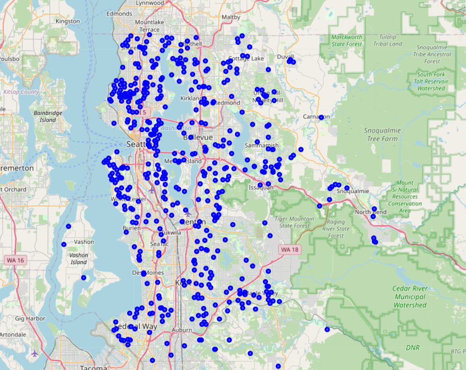

# House-Price-Prediction
<!-- Cover Image -->

  

Training regression models to forecast house price. Conduct initial exploratory analysis into the data set before building several models (Linear Regression, Ridge Regression, Random Forest, XGBoost, LightGBMregressor, Neural Network and Ensemble Stacking Method). These results are then compared and visualised. 
To use the optimal model for house price prediction, open Predict_House_Price_ipynb and input the specific house data to generate an accurate valuation.
